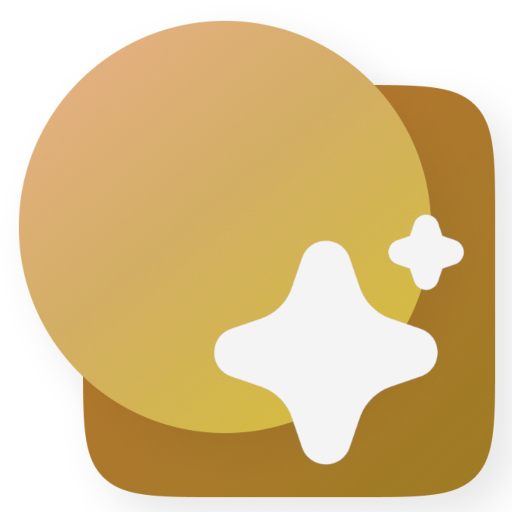
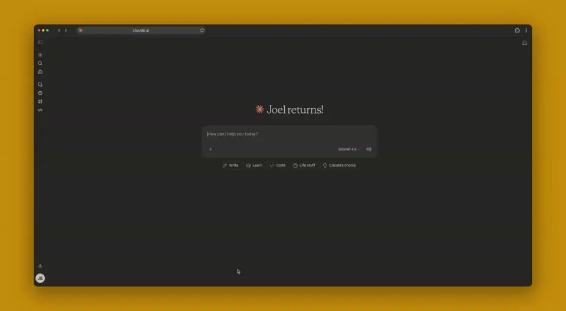

<p align="center">
  
</p>

<h1 align="center">Slidev MCP</h1>

<p align="center">
  Ask your AI to create a presentation. Get a shareable link.
</p>

<p align="center">
  <a href="https://slidev-mcp.org">Docs</a> &middot;
  <a href="#quick-start">Quick Start</a> &middot;
  <a href="#supported-clients">Clients</a> &middot;
  <a href="#themes">Themes</a>
</p>

<p align="center">
  <a href="https://github.com/joelbarmettlerUZH/slidev-mcp/actions/workflows/ci.yml"></a>
  <a href="LICENSE.md"></a>
</p>

<p align="center" width="100%">
  
</p>

---

## How It Works

1. **Connect** your AI assistant to `mcp.slidev-mcp.org/mcp`
2. **Ask** it to create a presentation on any topic
3. **Share** the link it gives you &mdash; it works in any browser, no login required

Your slides are hosted and ready to present. Bookmark them, send them to a colleague, or open them on your phone.

## Quick Start

### Claude Code

```bash
claude mcp add --scope user slidev-mcp --transport streamable-http https://mcp.slidev-mcp.org/mcp
```

That's it. Start a conversation and ask Claude to make a presentation.

### Claude Desktop / claude.ai

Add `mcp.slidev-mcp.org/mcp` as a [custom connector](https://support.anthropic.com/en/articles/11175166-getting-started-with-custom-connectors-using-remote-mcp) in Settings > Connectors.

### Cursor

Add to `.cursor/mcp.json`:

```json
{
  "mcpServers": {
    "slidev-mcp": {
      "url": "https://mcp.slidev-mcp.org/mcp"
    }
  }
}
```

### Other Clients

Any MCP client that supports [streamable HTTP](https://modelcontextprotocol.io/) works with:

```
https://mcp.slidev-mcp.org/mcp
```

See [client setup guides](https://slidev-mcp.org/clients/) for Windsurf, VS Code, JetBrains, Zed, Opencode, Gemini CLI, and ChatGPT.

## What You Can Do

- **Create presentations** &mdash; describe what you want, pick a theme, get slides
- **Update slides** &mdash; ask for changes and the same URL updates in place
- **Browse themes** &mdash; ask to see the theme gallery or let the AI pick one for you
- **Learn Slidev** &mdash; the AI reads the Slidev docs automatically and uses theme-specific layouts and components

## Sharing Your Slides

Every presentation gets a permanent URL like:

```
https://slides.slidev-mcp.org/slides/abc123-def456/
```

- Open it in any browser &mdash; no login, no app required
- Bookmark it for later
- Send it to anyone
- Present directly from the browser (press `f` for fullscreen)
- Slides stay available for 30 days after your session ends

While your session is active, you can keep updating the same presentation. Once you disconnect, the slides become a permanent snapshot.

## Themes

24 pre-installed themes to choose from:

**Official:** `default`, `seriph`, `apple-basic`, `bricks`, `shibainu`

**Community:** `academic`, `cobalt`, `dracula`, `eloc`, `field-manual`, `frankfurt`, `geist`, `neocarbon`, `neversink`, `nord`, `penguin`, `purplin`, `scholarly`, `swiss-ai-hub`, `the-unnamed`, `unicorn`, `vibe`, `vuetiful`, `zhozhoba`

Ask your AI to "show me the themes" for a visual gallery, or describe a style like "something dark and modern" and let it pick.

## Supported Clients

| Client | Type | Setup |
|---|---|---|
| [Claude Code](https://slidev-mcp.org/clients/claude-code) | CLI | One command |
| [Claude Desktop / claude.ai](https://slidev-mcp.org/clients/claude-desktop) | Desktop / Web | Custom connector |
| [Cursor](https://slidev-mcp.org/clients/cursor) | IDE | JSON config |
| [Windsurf](https://slidev-mcp.org/clients/windsurf) | IDE | JSON config |
| [VS Code (Copilot)](https://slidev-mcp.org/clients/vscode) | IDE | JSON config |
| [JetBrains IDEs](https://slidev-mcp.org/clients/jetbrains) | IDE | JSON config |
| [Zed](https://slidev-mcp.org/clients/zed) | IDE | JSON config |
| [Opencode](https://slidev-mcp.org/clients/opencode) | CLI | JSON config |
| [Gemini CLI](https://slidev-mcp.org/clients/gemini-cli) | CLI | JSON config |
| [ChatGPT](https://slidev-mcp.org/clients/chatgpt) | Web / Desktop | JSON config |

## Self-Hosting

Slidev MCP can be self-hosted on your own server. See the [deployment guide](https://slidev-mcp.org/guide/deployment) for Docker Compose setup with Let's Encrypt TLS.

## Development

```bash
make install          # Install Python dependencies
make docker-dev-up    # Start Postgres + Builder
make serve            # Run MCP server locally
make pr-ready         # Lint + format + test
```

## License

[FSL-1.1-ALv2](LICENSE.md) &mdash; Functional Source License, converting to Apache 2.0 after two years.
