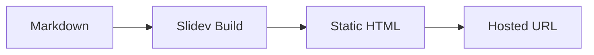

# Full Demo Deck

A comprehensive Slidev MCP example showcasing layouts, code, and animations

<div class="abs-br m-6 flex gap-2">
  <a href="https://sli.dev" target="_blank">sli.dev</a>
</div>

---
layout: two-cols
---

# Two-Column Layout

This slide uses the `two-cols` layout to split content into left and right panels.

**Left column** contains descriptive text.

::right::

**Right column** can have different content:

- Lists
- Images
- Code blocks

---

# Code Blocks

Slidev supports syntax-highlighted code with line highlighting:

```ts {2-3|5}
function greet(name: string): string {
  const greeting = `Hello, ${name}!`
  return greeting
}

const result = greet("Slidev")
```

<arrow v-click x1="300" y1="310" x2="195" y2="270" color="#953" width="2" />

---

# Click Animations

<v-click>

**Step 1:** This appears on the first click

</v-click>

<v-click>

**Step 2:** This appears on the second click

</v-click>

<v-click>

**Step 3:** And this on the third

</v-click>

---
layout: image-right
image: https://cover.sli.dev
---

# Image Layout

The `image-right` layout places an image on the right side of the slide.

- Great for screenshots
- Product demos
- Visual storytelling

> **Note:** Images must be remote URLs or base64-encoded inline. Local file paths are not supported in Slidev MCP.

---

# LaTeX Math

Inline math: $\sqrt{3x-1}+(1+x)^2$

Block math:

$$
\begin{aligned}
\nabla \times \vec{E} &= -\frac{\partial \vec{B}}{\partial t} \\
\nabla \times \vec{B} &= \mu_0 \vec{J} + \mu_0 \varepsilon_0 \frac{\partial \vec{E}}{\partial t}
\end{aligned}
$$

---
layout: center
class: text-center
---

# Centered Layout

This slide uses `layout: center` for focused content.

<div class="text-2xl font-bold mt-4">

Perfect for key messages or section dividers.

</div>

---

# Tables

| Feature | Supported | Notes |
|---------|-----------|-------|
| Markdown tables | Yes | Standard GFM syntax |
| Code blocks | Yes | With syntax highlighting |
| LaTeX | Yes | KaTeX rendering |
| Animations | Yes | `<v-click>` components |
| Remote images | Yes | Via URL |
| Local images | No | Use remote URLs instead |

---

# Diagrams with Mermaid



---
layout: center
class: text-center
---

# Thank You!

Built with [Slidev](https://sli.dev) via Slidev MCP

<div class="mt-4 text-sm opacity-50">

Images must be remote URLs or base64-encoded inline. Local file paths are not supported.

</div>
