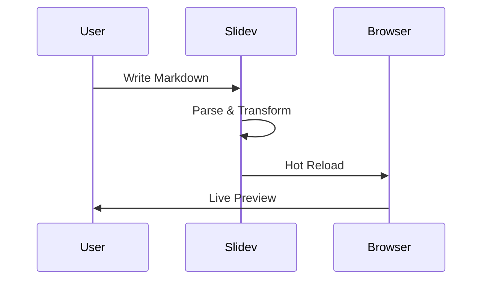
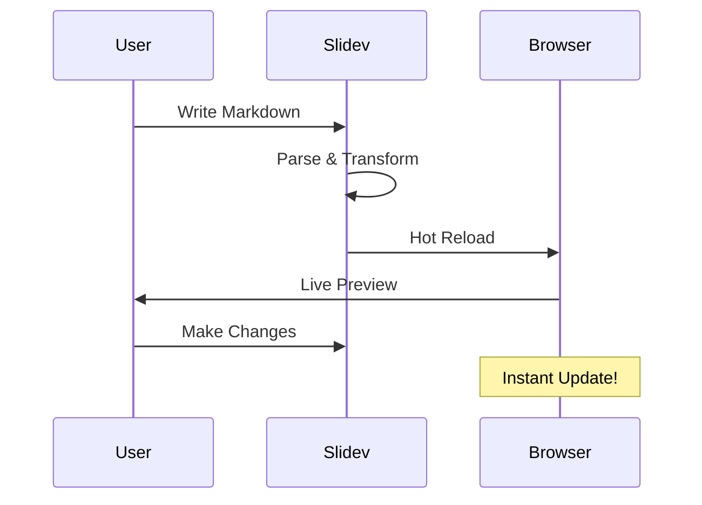
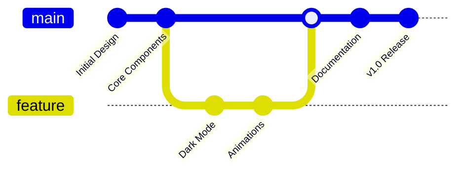
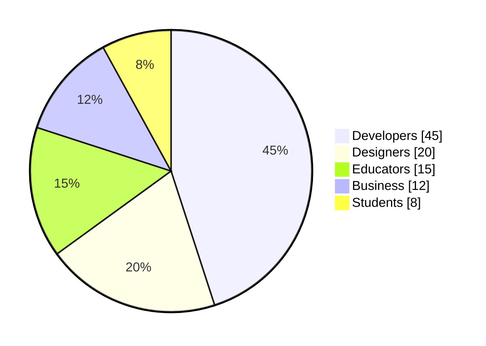

# Slidev Theme Swiss AI-Hub

[](https://www.npmjs.com/package/slidev-theme-swiss-ai-hub)

A professional, dark-themed [Slidev](https://sli.dev/) presentation template designed with the Swiss AI-Hub branding. Features gradient backgrounds, flexible section layouts, and comprehensive Slidev functionality support.


## Features

### 🎨 Swiss AI-Hub Branding
- Dark gradient backgrounds with customizable primary colors
- Professional bbv Software Services AG footer branding
- Clean, modern typography with Outfit sans-serif font

### 📐 Flexible Section Layouts
- **Multiple positioning options**: left, right, or centered content
- **Column support**: Split content into multiple columns
- **Customizable section headers**: Add prefix, postfix, and section numbers
- **Smooth transitions**: Built-in slide transition effects


### 🚀 Rich Content Support
- **Code highlighting**: Syntax highlighting with line emphasis support
- **Interactive code editor**: Monaco editor integration for live code editing
- **Mermaid diagrams**: Flowcharts, sequence diagrams, git graphs, and more
- **Mathematical expressions**: LaTeX math support for formulas and equations
- **Media embedding**: YouTube videos and social media embeds
- **Animations**: Smooth entrance effects and click-through reveals


## Installation

### Option 1: NPM
```bash
pnpm install slidev-theme-swiss-ai-hub
```

### Option 2: Add to your `package.json`
```json
{
  "devDependencies": {
    "slidev-theme-swiss-ai-hub": "^0.0.1"
  }
}
```

Then run:
```bash
pnpm install
```

## Usage

Add the theme to your Slidev presentation's frontmatter:

```yaml
---
theme: swiss-ai-hub
title: 'Your Presentation Title'
author: Your Name
mdc: true
lineNumbers: true
themeConfig:
  primary: '#440000'  # Optional: customize primary color
---
```

## Layouts

### Section Layout

The section layout provides a flexible container for organizing content with visual hierarchy:

```markdown
---
layout: section
position: left        # left or right
transition: slide-left
prefix: "Chapter 1"   # Optional: Small text above title
postfix: "Introduction"  # Optional: Small text below title
sectionTitle: "Getting Started"
sectionNumber: 1
columnCount: 2        # Optional: Split content into columns
---

# Your Content Here

Content for the first column

<ColumnBreak />

Content for the second column
```

**Available options:**
- `position`: `left` or `right` alignment
- `transition`: Slide transition effect
- `prefix`: Small text displayed above the section title
- `postfix`: Small text displayed below the section title
- `sectionTitle`: Main section title
- `sectionNumber`: Section number for navigation
- `columnCount`: Number of columns (1 or 2)

### Default Layout

The standard layout includes header and footer with gradient background:

```markdown
---
layout: default
---

# Slide Title

Your content here
```

### Cover Layout

A clean cover slide for your presentation intro:

```markdown
---
layout: cover
---

# Presentation Title

## Subtitle or description
```

## Components

### ColumnBreak
Split content into multiple columns within section layouts:

```markdown
<ColumnBreak />
```

### Gradient Background
The theme automatically applies gradient backgrounds to all slides. The gradient adapts based on the configured primary color.

## Available Scripts

```bash
# Development server
pnpm run dev

# Build presentation
pnpm run build

# Export to PDF
pnpm run export

# Export to PNG images
pnpm run screenshot

# Run linter
pnpm run lint
```

## Theme Configuration

Customize the theme in your presentation's frontmatter:

```yaml
themeConfig:
  primary: '#440000'  # Primary color for gradients and accents
```

## Example Presentation

Check out `example.md` for a comprehensive showcase of all theme features, including:

- Table of contents
- Code highlighting with line emphasis
- Mermaid diagrams (sequence, git graphs, pie charts)
- Mathematical formulas
- Media embedding
- Interactive components
- Animation effects
- Export options

### Feature Highlights from Example

#### Code Highlighting
```python
def fibonacci(n):
    if n <= 0:
        return []
    elif n == 1:
        return [0]
    else:
        fib = [0, 1]
        for i in range(2, n):
            fib.append(fib[i-1] + fib[i-2])
        return fib
```

#### Mermaid Diagrams


#### Mathematical Expressions
- Block math: $$\int_{0}^{\infty} e^{-x^2} dx = \frac{\sqrt{\pi}}{2}$$
- Inline math: $E = mc^2$

## Tech Stack

- **Slidev**: Presentation framework
- **Vue 3**: Component framework
- **UnoCSS**: Atomic CSS engine
- **TypeScript**: Type safety
- **Shiki**: Syntax highlighting
- **Monaco Editor**: Code editing
- **Mermaid**: Diagram support

## Development

To contribute or customize the theme:

1. Clone the repository
2. Install dependencies: `pnpm install`
3. Start development: `pnpm run dev`
4. Make your changes in the theme files
5. Test with the example presentation

### Project Structure

```
slidev-theme-swiss-ai-hub/
├── layouts/           # Slide layouts
│   ├── cover.vue
│   ├── default.vue
│   └── section.vue
├── components/        # Reusable components
│   ├── default-header.vue
│   ├── default-footer.vue
│   ├── gradient-background.vue
│   └── ColumnBreak.vue
├── setup/            # Setup files
│   ├── monaco.ts
│   ├── mermaid.ts
│   └── shiki.ts
├── uno.config.ts     # UnoCSS configuration
├── example.md        # Example presentation
└── package.json
```

## Contributing

- `pnpm install` - Install dependencies
- `pnpm run dev` - Start theme preview of `example.md`
- Edit the `example.md` and style files to see changes
- `pnpm run export` - Generate preview PDF
- `pnpm run screenshot` - Generate preview PNG

## Demo

View the live demo: [https://bbvch-ai.github.io/slidev-theme-swiss-ai-hub/](https://bbvch-ai.github.io/slidev-theme-swiss-ai-hub/)

## License

Apache-2.0

## Credits

Created for [Swiss AI-Hub](https://swiss-ai-hub.ch) by [bbv Software Services AG](https://www.bbv.ch)

## Support

For issues, questions, or contributions, please visit our [GitHub repository](https://github.com/bbvch-ai/slidev-theme-swiss-ai-hub).


---

# Example Slides

The following is the theme's example presentation showing available layouts, components, and features:

````markdown
---
theme: ./
title: 'Slidev Theme Showcase'
author: Your Name
mdc: true
lineNumbers: true
themeConfig:
  primary: '#440000'
---

# Swiss AI-Hub Theme

## Built in the Swiss AI-Hub Brand

---

<Toc list-class="text-white" />

---
layout: section
position: left
transition: slide-left
prefix: "Introduction"
postfix: "Welcome"
sectionTitle: "Why Choose This Theme?"
sectionNumber: 1
columnCount: 2
---

# Welcome to Our Theme

**Built for Modern Presentations:**

- Clean, professional design
- Dark gradient backgrounds
- Flexible section layouts
- Full Slidev feature support

<ColumnBreak />

**Perfect for:**

- Technical presentations
- Business proposals
- Educational content
- Conference talks


---
layout: section
position: right
transition: slide-left
prefix: "Features"
postfix: "Code Support"
sectionTitle: "Syntax Highlighting"
sectionNumber: 2
---

# Code Highlighting

<v-clicks>

```python {2-4|6-7|all}
def fibonacci(n):
    if n <= 0:
        return []
    elif n == 1:
        return [0]
    else:
        fib = [0, 1]
        for i in range(2, n):
            fib.append(fib[i-1] + fib[i-2])
        return fib
```

**Features:** Line highlighting • Multiple languages • Theme support

</v-clicks>

---
layout: section
position: left
transition: slide-left
prefix: "Media"
postfix: "Rich Content"
sectionTitle: "Embedded Media & Videos"
sectionNumber: 3
---

# Rich Media Support


<Youtube id="dQw4w9WgXcQ" width="400" height="225" />

---
layout: section
position: right
transition: slide-left
prefix: "Diagrams"
postfix: "Visualization"
sectionTitle: "Mermaid Diagrams"
sectionNumber: 4
---

# Visual Diagrams

<v-clicks>



</v-clicks>

---
layout: section
position: left
transition: slide-left
prefix: "Annotations"
postfix: "Visual Guides"
sectionTitle: "Arrows & Annotations"
sectionNumber: 5
---

# Visual Annotations

<v-clicks>

<div class="grid grid-cols-2 gap-8">
<div>

### Key Feature
Content goes here

</div>
<div>

### Important Note
More content here

</div>
</div>

</v-clicks>

<v-click>

<Arrow x1="200" y1="250" x2="350" y2="180" />

</v-click>

<v-click>

<Arrow x1="550" y1="250" x2="400" y2="180" color="red" />

</v-click>

---
layout: section
position: right
transition: slide-left
prefix: "Tables"
postfix: "Data Display"
sectionTitle: "Data Presentation"
sectionNumber: 6
columnCount: 2
---

# Performance Metrics

| Framework | Build Time | Bundle Size |
|-----------|------------|-------------|
| Slidev    | 0.5s       | 450 KB      |
| PowerPoint| N/A        | 2.5 MB      |
| Keynote   | N/A        | 3.1 MB      |

<ColumnBreak />

<v-clicks>

**Advantages:**
- Lightning fast
- Minimal size
- Git-friendly
- Version control

</v-clicks>

---
layout: section
position: left
transition: slide-left
prefix: "Interactive"
postfix: "Components"
sectionTitle: "Interactive Elements"
sectionNumber: 7
---

# Interactive Code

<v-clicks>

```ts {monaco}
// Try editing this code!
interface Presenter {
  name: string
  slides: number
  awesome: boolean
}

const myPresentation: Presenter = {
  name: "Slidev Theme Demo",
  slides: 15,
  awesome: true
}

console.log(myPresentation)
```

</v-clicks>

---
layout: section
position: right
transition: slide-left
prefix: "Timeline"
postfix: "Roadmap"
sectionTitle: "Project Timeline"
sectionNumber: 8
---

# Development Journey

<v-clicks>



</v-clicks>

---
layout: section
position: left
transition: slide-left
prefix: "Analytics"
postfix: "Insights"
sectionTitle: "Usage Statistics"
sectionNumber: 9
columnCount: 1
---

# Theme Analytics



---
layout: section
position: right
transition: slide-left
prefix: "Mathematics"
postfix: "Formulas"
sectionTitle: "Mathematical Expressions"
sectionNumber: 10
---

# Mathematical Support

<v-clicks>

**Block Math:**

$$
\int_{0}^{\infty} e^{-x^2} dx = \frac{\sqrt{\pi}}{2}
$$

**Inline Math:** The formula $E = mc^2$ changed physics forever.

**Matrix:**

$$
\begin{bmatrix}
a & b \\
c & d
\end{bmatrix}
$$

</v-clicks>

---
layout: section
position: left
transition: slide-left
prefix: "Presenter"
postfix: "Mode"
sectionTitle: "Presenter View"
sectionNumber: 11
columnCount: 2
---

# Presenter Features

**Speaker Notes:**

Press `Shift + Enter` to toggle presenter mode

<v-clicks>

- Timer display
- Next slide preview
- Notes section
- Current slide number

</v-clicks>

<ColumnBreak />

**Shortcuts:**

<v-clicks>

- `f` - fullscreen
- `g` - go to slide
- `d` - toggle dark
- `o` - overview mode

</v-clicks>

<!--
These are presenter notes!
They won't be visible to the audience.
Perfect for reminders and talking points.
-->

---
layout: section
position: right
transition: slide-left
prefix: "Components"
postfix: "Built-in"
sectionTitle: "Slidev Components"
sectionNumber: 12
---

# Built-in Components

<v-clicks>

<Tweet id="1390115482657726468" />

</v-clicks>

---
layout: section
position: left
transition: slide-left
prefix: "Export"
postfix: "Options"
sectionTitle: "Export Formats"
sectionNumber: 13
columnCount: 2
---

# Export Options

<v-clicks>

**Formats:**
- PDF slides
- PDF with notes
- PNG images
- Single-page app
- Markdown

</v-clicks>

<ColumnBreak />

<v-clicks>

**Commands:**
```bash
# Export to PDF
slidev export

# With notes
slidev export --with-clicks

# As images
slidev export --format png
```

</v-clicks>

---
layout: section
position: right
transition: slide-left
prefix: "Advanced"
postfix: "Techniques"
sectionTitle: "Animation & Motion"
sectionNumber: 14
---

# Smooth Animations

<div v-motion
  :initial="{ x: -80, opacity: 0 }"
  :enter="{ x: 0, opacity: 1 }">

## Entrance Effects

</div>

<v-clicks>

<div v-motion
  :initial="{ y: 40, opacity: 0 }"
  :enter="{ y: 0, opacity: 1 }">

- Slide transitions
- Element animations
- Hover states

</div>

<div v-motion
  :initial="{ scale: 0.5 }"
  :enter="{ scale: 1 }">

**Make presentations dynamic!**

</div>

</v-clicks>

---
layout: section
position: left
transition: slide-left
prefix: "Conclusion"
postfix: "Thank You"
sectionTitle: "Start Building Today"
sectionNumber: 15
columnCount: 2
---

# Ready to Create?

<v-clicks>

**Quick Start:**
```bash
npm init slidev
npm install theme
npm run dev
```

**Resources:**
- [Documentation](#)
- [Examples](#)
- [Discord](#)

</v-clicks>

<ColumnBreak />

<v-clicks>

**Features:**
- 🚀 Fast refresh
- 📝 Markdown
- 🎨 Themes
- 🧑‍💻 Code blocks
- 📊 Diagrams
- 🎥 Media
- ✨ Animations

**Thank you!**

</v-clicks>
````
